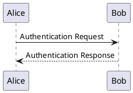

# PlantUML Support - Build & Deploy Guide

## Overview

PlantUML diagrams are now supported via the `mkdocs-kroki-plugin`, which uses the Kroki service to render diagrams. This approach:

- ✅ **No local Java installation required** - Diagrams are rendered via https://kroki.io
- ✅ **Portable markdown** - PlantUML code stays in standard markdown fenced code blocks
- ✅ **Multiple diagram types supported** - PlantUML, BlockDiag, BPMN, Excalidraw, and more
- ✅ **Works locally and in CI/CD** - Same rendering everywhere

## How to Use PlantUML

In your markdown files, create a fenced code block with `plantuml` as the language:

````markdown

````

The plugin will automatically convert this to an embedded diagram image.

### Other Supported Diagram Types

The Kroki plugin also supports:

- `blockdiag` - Block diagrams
- `bpmn` - Business Process Model diagrams
- `excalidraw` - Hand-drawn style diagrams
- `graphviz` - DOT language graphs
- `ditaa` - ASCII art to diagrams
- And many more: https://kroki.io/#support

## Phase 1: Local Build Workflow

### Prerequisites

- Conda installed on your system
- Internet connection (for Kroki service to render diagrams)

### Step-by-Step Local Build

1. **Run the build script:**
   ```bash
   ./build.sh
   ```

   This script will:
   - Check for conda installation
   - Create/activate the `software-quality` conda environment
   - Install/update all dependencies from `requirements.txt`
   - Build the site with `mkdocs build --strict`

2. **Preview the site locally:**
   ```bash
   conda activate software-quality
   mkdocs serve
   ```

   Then open http://127.0.0.1:8000 in your browser.

3. **Verify PlantUML works:**
   - Create a test page with a PlantUML diagram
   - Build the site and verify the diagram renders

### Manual Build (Alternative)

If you prefer to run commands manually:

```bash
# Activate conda environment
conda activate software-quality

# Install/update dependencies
pip install -r requirements.txt

# Build the site
mkdocs build --strict

# OR preview with live reload
mkdocs serve
```

## Phase 2: GitHub Actions Workflow

The GitHub Actions workflow (`.github/workflows/deploy-docs.yml`) has been updated to:

1. Install Python 3.11
2. Install all dependencies from `requirements.txt` (including mkdocs-kroki-plugin)
3. Build the site with `mkdocs build --strict`
4. Deploy to the `gh-pages` branch

### How It Works

- **Trigger:** Runs on every push to `main` branch
- **Kroki Service:** GitHub Actions can access https://kroki.io to render diagrams
- **No additional setup needed:** The plugin works out of the box in CI/CD

### Workflow Steps

```yaml
- Install Python 3.11
- Install dependencies (pip install -r requirements.txt)
  └─> Installs mkdocs-material and mkdocs-kroki-plugin
- Build site (mkdocs build --strict)
  └─> Kroki plugin processes all diagram code blocks
  └─> Diagrams are rendered via Kroki API
- Deploy to GitHub Pages
```

## Configuration

### requirements.txt
```
mkdocs-material>=9.5.0
mkdocs-kroki-plugin>=0.9.0
```

### mkdocs.yml
```yaml
plugins:
  - search
  - kroki:
      ServerURL: https://kroki.io
      FencePrefix: ""
      EnableBlockDiag: true
      Enablebpmn: true
      EnableExcalidraw: true
      EnableMermaid: false  # Using Material's native mermaid support
      FileTypes:
        - png
        - svg
```

## Offline / Self-Hosted Option

If you need to build offline or want to self-host the diagram rendering:

1. **Run Kroki locally with Docker:**
   ```bash
   docker run -p 8000:8000 yuzutech/kroki
   ```

2. **Update mkdocs.yml:**
   ```yaml
   plugins:
     - kroki:
         ServerURL: http://localhost:8000
   ```

3. **Build normally:**
   ```bash
   mkdocs build
   ```

## Troubleshooting

### Diagrams not rendering locally
- Check internet connection (Kroki service needs to be accessible)
- Verify the syntax of your PlantUML code
- Check browser console for errors

### Build fails in GitHub Actions
- Check that `mkdocs-kroki-plugin` is in requirements.txt
- Verify GitHub Actions runner can access https://kroki.io
- Check GitHub Actions logs for specific errors

### Syntax Errors
- PlantUML syntax must be valid
- Test your diagrams at https://www.plantuml.com/plantuml/uml/
- Ensure `@startuml` and `@enduml` tags are present

## Migration Complete

Both local and CI/CD workflows now support PlantUML and other diagram types with zero additional infrastructure requirements!
