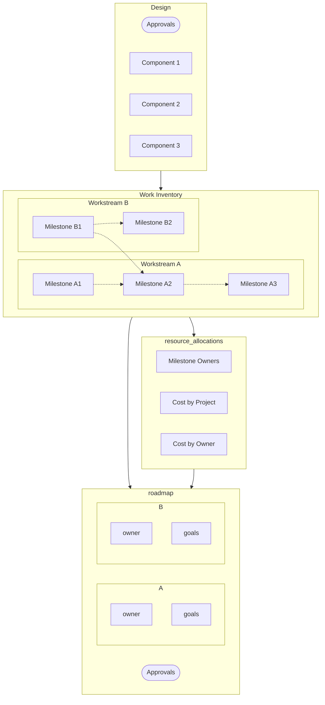

## Overview

In this phase, you will take the following steps, and produce planning artifacts at multiple steps.

1. Break the design down into independent "workstreams"
2. Break down each workstream into a sequence of "milestones" with clear deliverables
3. Decide who will work on each workstream
4. Determine when each milestone will be done by
5. Identify risks to the plan, and add buffer time or resources
6. Get approval from management, and the people who will work on this

## A Note About Tools

Your company may already have tools for project planning and management.
Use your company's tools. However, most tools don't have much rigor "built-in";
You will still perform better by sticking to the following guidance.

## Work Inventory

The engineer in charge of the project will create a work inventory doc (LINK TODO).
The work inventory establishes what work needs to be done
and how much effort each piece of work will take (measured in SWE work time).

To simplify the planning process, split the work into "workstreams" which could be independently
executed by other engineers.

Each workstream should be broken down into measurable, incremental goals ("milestones").
For each milestone, you need to describe:
1. Estimate of work to reach the milestone, assuming dependencies are already completed
2. Description of the work to reach the milestone - later will be broken into tasks
3. Any dependencies on other milestones that have to be done first

## Roadmapping

This step is a negotiation between people in multiple roles, generally driven by TPM or Manager.
Here we determine:
1. Who will own which workstreams
2. When the milestones will be due

The final deliverable is a roadmap doc (LINK TODO).
You may use a spreadsheet to check your resource allocations (LINK TODO).

## Negotiation

In order to get agreement from all stakeholders on the roadmap document,
you also need to ensure any dependencies are handled in other roadmap documents.
