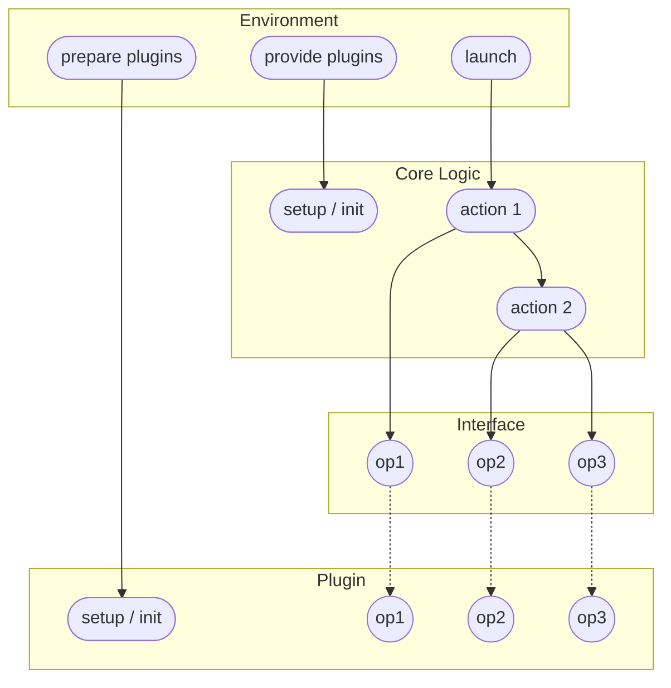

# The Clean Plugin Architecture

## Why?

When building software, it's critical to identify the portions of the software that
may evolve independently or change direction in the future. Classic examples include:
1. You may change your backing storage
2. You may change the way you log things
3. You may want to relocate part of your logic to its own service later
4. You may want to redistribute chunks of your service logic in a CLI
5. Your service may want to integrate with many similar customer systems
6. You may want to allow customers to extend your service with custom logic

We want to make it so that none of your system needs to be rewritten or copied for each
new scenario. Each time you add a new scenario, you should only have to write some new
code to directly support it. None of your core logic should change.

You'll actually need multiple components in order to separate those pieces cleanly:
1. Defining the non-changing, reusable core logic (`Core Logic`)
2. Defining what your core logic requires from each plugin or module (`Interface`)
3. Defining the plugins and modules themselves (`Plugin`)
4. Connecting the plugins and actually running your core logic on them (`Environment`)

All of the concerns above are things you may want to evolve independently over time,
so each should get their own component in this design.

The Clean Plugin Architecture provides a reusable / implementable set of components
that is viable in any programming language, and ensures strong isolation. It can tolerate
cases where each piece is owned by a different developer.

**There are many places where this pattern already shows up in part or whole. I did not
invent this pattern, I am just formalizing it for your consumption**.

## Components

1. The `Environment` is what executes the whole system. It knows how to:
    1. Initialize the core logic
    2. Find and initialize plugins
    3. Plug them into the core logic
    4. Run the core logic
2. The `Core Logic` is the reusable logic that will rely on our plugins
3. The `Interface` is an interface or specification of what the plugins need to support
4. The `Plugin` is one module that supports all the needed operations. It can be plugged
    in, potentially alongside other plugins for the core logic to use.



With this architecture, you can easily add new `Plugin`s and get them working quickly
without changing your `Core Logic`, which is the goal we wanted to achieve!

Keep in mind that this diagram is not canonical. Some things that may differ:
1. The `Environment` may provide `Plugins` as arguments to the `Core Logic`'s actual
    methods, rather than providing them at setup
2. The `Core Logic` could just be some hard-coded functions with no setup process
3. The `Core Logic` may have several separately-triggered actions available
4. The `Core Logic` may be invoked by someone other than the `Environment`, e.g.
    if the `Core Logic` is actually a service launched by the `Environment`
5. The `Interface` may actually define its own initialization method and be initialized
    directly by the core logic (after some other loading process to get access to it)
6. The `Plugins` may be initialized and passed to the environment a different way

In the wild, you may know or discover that:
1. All of these components may have different names
2. The most common reusable tool for this is a Dependency Injection Framework
3. Some systems such as Interface Definition Languages only provide `Interface` or
    a different, limited subset of the components above.
4. You may have several layers of plugins (and plugins with their own plugins)
5. It takes a lot of extra work to generalize this to the point where each component
    is its own service or has truly independent operations. **A few exciting open
    source projects are trying to solve this at the moment!**

## A Concrete Example in Code

### Environment

For this example I express the `Environment` as a `main` method. This is essentially the
role that the `Environment` generally takes, organizing all of the other computation.

```python
from my_package.storage.plugin_one import StoragePluginNumberOne
from my_pagkage.core import CoreLogic

def _prep_core_logic() -> CoreLogic:
    storage = StoragePluginNumberOne()
    core = CoreLogic(storage=storage)
    return core

def main():
    # this environment is just for running a simple test
    core = _prep_core_logic()
    print(core.foo(5))
    print(core.bar(10))

if __name__ == "__main__":
    main()
```

### Core Logic

This is the concrete class or set of functions that use our pluggable components. There should be only one logic that is applied to any plugins that are prepared. We should have a mechanism to receive at runtime the specific plugin implementations that will be used.

In the code below, pay attention to the use of `StorageInterface` and `_storage`.

```python
import logging
from my_package.storage.interface import StorageInterface

log = logging.getLogger(__name__)

class CoreLogic:
    def __init__(self, storage: StorageInterface) -> None:
        self._storage = storage
    
    def foo(self, baz: int) -> None:
        result = self._storage.insert_entry(k=str(baz), v=str(baz * 2))
        if not result:
            log.warning(f"Existing entry for {baz}, need more batteries!")
        return
    
    def bar(self, wow: int) -> bool:
        result = self._storage.get_entry(str(int(wow / 2)))
        if result is None:
            log.warning(f"No existing entry for {wow}, need more batteries!")
        return result == wow
```

### Interface

This can be a straightforward interface or abstract class. It should declare all of the
operations that implementors need to support. Some examples:
1. Any storage that I use should support these operations
2. Any logging system that I use should support these operations
3. Any user-provided plugins must support these operations
4. Any environment where I want to execute my core logic should support these operations

```python
from abc import ABC, abstractmethod
from typing import Optional

class StorageInterface(ABC):
    @abstractmethod
    def insert_entry(self, k: str, v: str) -> bool:
        pass
    
    @abstractmethod
    def get_entry(self, k: str) -> Optional[str]:
        pass
```

### Plugin

This is the concrete plugin that is scenario-specific and lets our core logic operate
in that scenario without any other changes.

```python
from my_package.storage.interface import StorageInterface

class StoragePluginNumberOne(StorageInterface):
    def __init__(self) -> None:
        self._data = {}
    
    @abstractmethod
    def insert_entry(self, k: str, v: str) -> bool:
        if k in self._data:
            return False
        self._data[k] = v
        return True
    
    @abstractmethod
    def get_entry(self, k: str) -> Optional[str]:
        return self._data.get(k)
```

## Considerations

### Dependency Management

For the code examples above, pay special attention to the `import` statements.
1. `Core Logic` depends ONLY on `Interface`. It is completely unaware of the `Plugin`.
2. `Plugin` depends ONLY on `Interface`. It is completely unaware of the `Core Logic`.
3. `Environment` depends on both `Core Logic` and the specific `Plugin`s that it loads
    1. The `Environment` is the root of our actual application. If it doesn't depend on
        something, then that thing doesn't need to be packaged in our app at all! So it's
        a good thing that we don't have to depend on plugins we're not using.
    2. It takes more work to build a system where `Environment` can depend ONLY on the
        `Core Logic` and `Interface`. It's possible, but won't be covered here.

### Multiple Environments

WIP

### Testing

WIP
